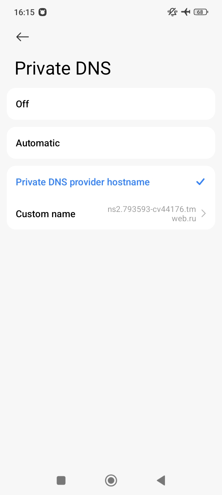
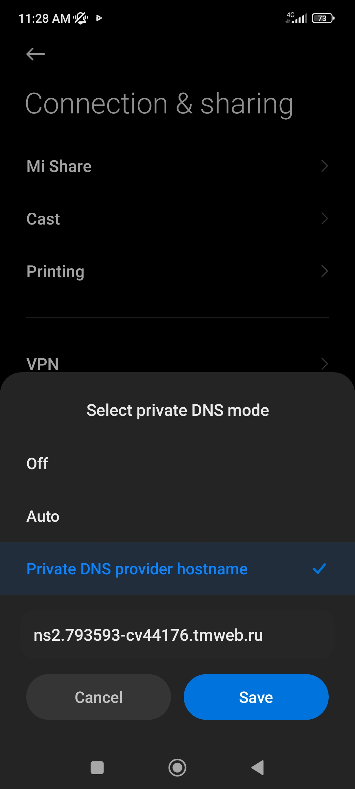
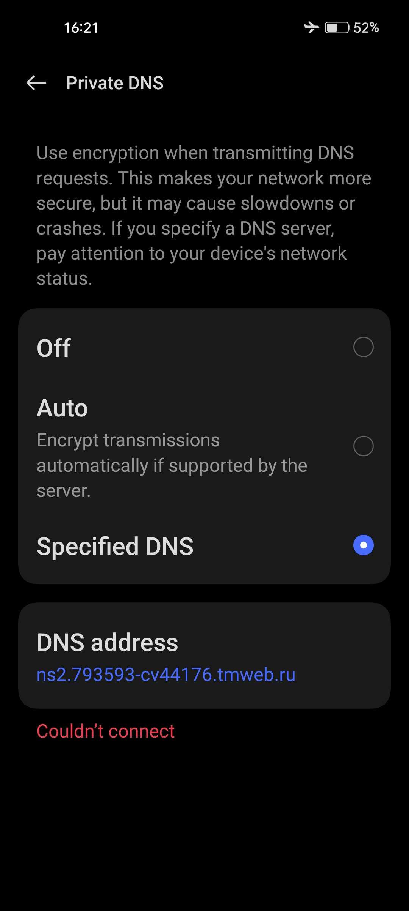

# dns-adblock-android-xiaomi-RU-region-firmware-adblock-working
Free of charge Domain NS blocking for some domains, these domains install some unwanted app from GETAPPS appstores.

If you don't want that some e.g. YANDEX untrusted apps installed in your XIAOMI without your touch in screen, e.g. Screenshot, use specified ns2.793593-cv44176.tmweb.ru
in 

HyperOS 2  Android 15 -  **More connectivity option** - **Private DNS** - **Private DNS provider hostname** - ns2.793593-cv44176.tmweb.ru

Xiaomi Android 11 - **Connection & sharing** - **Private DNS** - **Private DNS provider hostname** - ns2.793593-cv44176.tmweb.ru

Also may be used for adblocking in realme , 
Android 13 - **Connection & sharing** - **Private DNS** - **Specified DNS** - ns2.793593-cv44176.tmweb.ru

This service is also working for me in Israel near border Lebanon, Middle east
